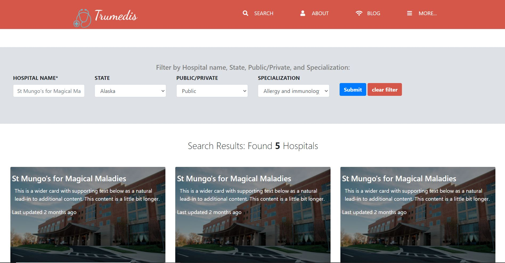

# Directory-of-Hospitals

Design of a USA-based Directory of Hospitals

This is a project for the Microverse training program, Week 4, where I created a design for a new website based on design criteria from [the design of PatashuleKE](https://www.behance.net/gallery/25563385/PatashuleKE).

## Built With

HTML
CSS
Bootstrap

## Live Demo

https://trumedis.netlify.app/

## Installation

1) Clone or download the files as a .zip file.

2) Unzip the files to a folder, if you downloaded a .zip file.

3) Double click on [index.html](./index.html) to open the main page of the website in a browser

## Author 👤

### Ayman Jabr

_[Github](https://github.com/AymanJabr/)

_[LinkedIn](https://www.linkedin.com/in/ayman-jabr-3705a4100/)

## Show your support ⭐️⭐️

Give a star if you like this project!

## License 📝

This project is [MIT](https://www.mit.edu/~amini/LICENSE.md) licensed.

